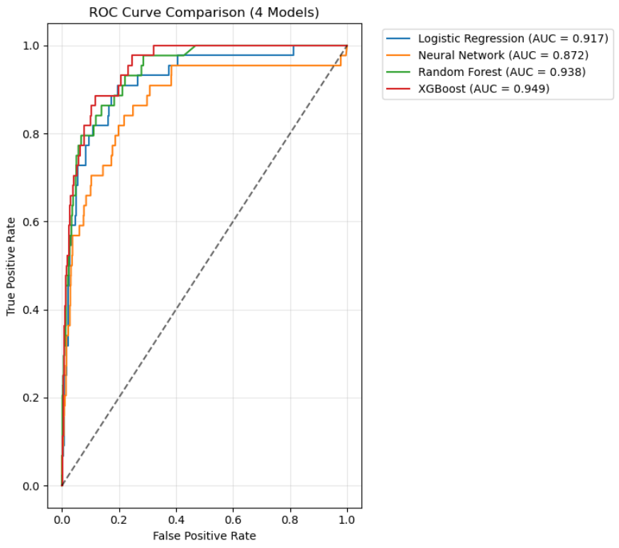
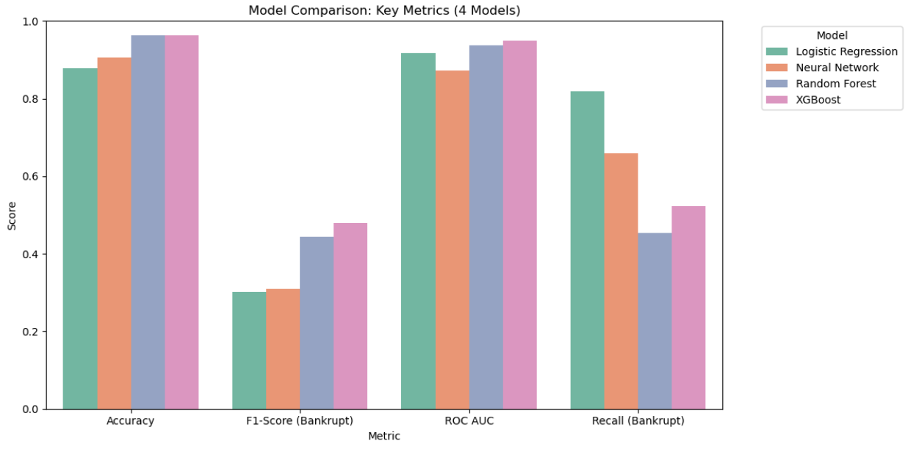

# 🏦 Company Bankruptcy Prediction: A Comparative Machine Learning Study

**Predicting corporate financial distress using historical Taiwanese financial data. A comprehensive analysis comparing four ML models on a highly imbalanced dataset.**

## 🎯 Business Problem
Corporate bankruptcy prediction is a critical task for financial institutions, investors, and regulatory bodies. Early identification of companies at risk enables:
- **Investors** to make informed decisions and mitigate portfolio risk
- **Banks** to assess creditworthiness and adjust lending terms
- **Regulators** to monitor systemic financial stability
- **Companies themselves** to take corrective actions before insolvency

This project develops and compares multiple machine learning models to predict bankruptcy risk using standardized financial ratios, providing an automated, data-driven risk assessment tool.

## 📊 Dataset Overview
The analysis uses the **"Company Bankruptcy Prediction"** dataset from Kaggle, containing financial data from Taiwanese companies (2000-2019).

| Aspect | Details |
|--------|---------|
| **Source** | [Kaggle Dataset](https://www.kaggle.com/datasets/fedesoriano/company-bankruptcy-prediction) |
| **Time Period** | 2000-2019 |
| **Total Companies** | 6,819 |
| **Features** | 95 financial ratios (profitability, liquidity, leverage, etc.) |
| **Target Variable** | `Bankrupt?` (1 = Bankrupt, 0 = Non-bankrupt) |
| **Class Distribution** | **3.23% bankrupt** (220 companies) vs **96.77% non-bankrupt** |

### ⚠️ Key Data Challenge: Extreme Class Imbalance
The dataset exhibits severe imbalance (3.23:96.77), a common but challenging characteristic of real-world financial failure data. This imbalance necessitated careful modeling strategies and evaluation metrics beyond simple accuracy.

## 🛠️ Methodology

### 1. Exploratory Data Analysis (EDA)
- **Class Distribution Analysis:** Visualized the severe imbalance using pie charts
- **Correlation Analysis:** Identified highly correlated feature pairs (>0.9 correlation) to understand multicollinearity
- **Data Quality Check:** Verified no missing values and examined basic statistics

### 2. Data Preprocessing
- **Feature-Target Separation:** Split into 95 features (X1-X95) and binary target
- **Train-Test Split:** 80-20 stratified split preserving class distribution
- **Feature Scaling:** StandardScaler applied for models requiring normalized inputs

### 3. Model Development & Training
Four distinct classification algorithms were implemented, each with strategies to handle class imbalance:

| Model | Key Configuration | Imbalance Handling |
|-------|-------------------|-------------------|
| **Logistic Regression** | Max iterations: 2000 | `class_weight='balanced'` |
| **Neural Network** | Architecture: 64-32-1 with Dropout | Class weight dictionary (1:15.5 weight) |
| **Random Forest** | 200 trees, max depth: 15 | `class_weight='balanced'` |
| **XGBoost** | 150 estimators, max depth: 8 | `scale_pos_weight` calculated from imbalance ratio |

### 4. Model Evaluation
Given the imbalance, evaluation focused on metrics beyond accuracy:

| Metric | Importance for Imbalanced Data |
|--------|--------------------------------|
| **F1-Score (Bankrupt class)** | Primary metric - harmonic mean of precision & recall |
| **ROC-AUC** | Overall discriminative ability regardless of threshold |
| **Recall (Bankrupt class)** | Ability to identify actual bankrupt companies |
| **Confusion Matrix** | Visual breakdown of TP, TN, FP, FN |
| **Precision (Bankrupt class)** | Accuracy when predicting bankruptcy |

## 📈 Key Results & Insights

### Model Performance Ranking
| Rank | Model | F1-Score (Bankrupt) | ROC-AUC | Recall (Bankrupt) | Accuracy |
|------|-------|---------------------|---------|-------------------|----------|
| 1 | **XGBoost** | **0.4792** | **0.9486** | 0.5227 | 0.9633 |
| 2 | Random Forest | 0.4444 | 0.9384 | 0.4545 | 0.9633 |
| 3 | Neural Network | 0.3102 | 0.8718 | 0.6591 | 0.9054 |
| 4 | Logistic Regression | 0.3025 | 0.9171 | **0.8182** | 0.8783 |

### 🎯 Key Findings

1. **XGBoost Performs Best Overall**
   - Achieved the highest **F1-Score (0.4792)** and **ROC-AUC (0.9486)**
   - Provides optimal balance between identifying bankrupt companies and minimizing false alarms
   - Demonstrates tree-based models' effectiveness on structured financial data

2. **Logistic Regression Maximizes Recall**
   - Identified **81.8% of all bankrupt companies** (Recall: 0.8182)
   - Ideal for scenarios where missing a bankruptcy is costlier than false positives
   - However, produces many false alarms (low precision)

3. **Neural Networks Underperformed**
   - Achieved only moderate performance despite architectural tuning
   - Likely due to limited dataset size relative to feature dimensionality
   - May benefit from more data or advanced regularization techniques

4. **Feature Correlation Analysis Revealed Redundancy**
   - 28 feature pairs showed >0.9 correlation
   - Examples: `Current Liability to Liability` vs `Current Liabilities/Liability` (r=1.0)
   - Future work could reduce dimensionality without significant information loss

### 📊 Visual Results Summary

*ROC curves showing XGBoost's superior discriminative ability*

*Bar chart comparing key metrics across all four models*

---
*Special thanks to my friend Alireza Asadollahi for helping me with the comprehensive and detailed Farsi report in this mini project.
Make sure to check it out: [Complete Farsi Report](report-fa/report.pdf)*
